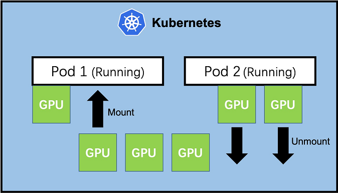

# GPU Mounter


GPU Mounter is a kubernetes plugin which enables add or remove GPU resources for running Pods. This [Introduction(In Chinese)](https://zhuanlan.zhihu.com/p/338251170) is recommended to read which can help you understand what and why is GPU Mounter.



## Features

* Supports add or remove GPU resources of running Pod without stopping or restarting
* Compatible with kubernetes scheduler


## Prerequisite 

* Kubernetes v1.16.2 / v1.18.6 (other version not tested, v1.13+ is required, v1.15+ is recommended)
* Docker 19.03/18.09 (other version not tested)
* Nvidia GPU device plugin
* `nvidia-container-runtime` (must be configured as default runtime)

NOTE: If you are using GPU Mounter on Kubernetes v1.13 or v1.14, you need to [manually enable the feature `KubeletPodResources`](https://kubernetes.io/docs/reference/command-line-tools-reference/feature-gates/). It is enabled by default in Kubernetes v1.15+.


## Deploy

* label GPU nodes with `gpu-mounter-enable=enable`

```shell
kubectl label node <nodename> gpu-mounter-enable=enable
```

* deploy

```bash
./deploy.sh deploy
```

* uninstall

```shell
./deploy.sh uninstall
```


## Quick Start

### create a Pod

NOTE:

Set environment variable `NVIDIA_VISIBLE_DEVICES`  to tell `nvidia-container-runtime` add CUDA library for the container, so we can check GPU state by `nvidia-smi` in the container. 

Set the `gpu-mounter-enable: enable` nodeSelector to ensure the pod is scheduled to GPUMounter enabled nodes.

```yaml
apiVersion: v1
kind: Pod
metadata:
  name: gpu-pod
spec:
  nodeSelector:
    gpu-mounter-enable: enable
  containers:
    - name: cuda-container
      image: tensorflow/tensorflow:1.13.2-gpu
      command: ["/bin/sh"]
      args: ["-c", "while true; do echo hello; sleep 10;done"]
      env:
       - name: NVIDIA_VISIBLE_DEVICES
         value: "none"
```


### call service

For security reasons, the `gpu-mounter-service` was deployed in `ClusterIP` type. We temporarily expose it through the `kubectl proxy` for testing.

```shell
kubectl proxy --address='0.0.0.0'  --accept-hosts='^*$' --port=8009
```

#### 0. check GPU

```shell
$ kubectl exec -it gpu-pod -- nvidia-smi -L
No devices found.
```


#### 1. add GPU

`GET /addgpu/namespace/:namespace/pod/:pod/gpu/:gpuNum`

```shell
curl --location \
--request GET 'http://127.0.0.1:8009/api/v1/namespaces/kube-system/services/gpu-mounter-service/proxy/addgpu/namespace/default/pod/gpu-pod/gpu/4'
```

check GPU state

```shell
$ kubectl exec -it gpu-pod -- nvidia-smi -L
GPU 0: Tesla V100-PCIE-32GB (UUID: GPU-f61ffc1a-9e61-1c0e-2211-4f8f252fe7bc)
GPU 1: Tesla V100-PCIE-32GB (UUID: GPU-88f0f450-20e1-1594-5290-0432e706d9df)
GPU 2: Tesla V100-PCIE-32GB (UUID: GPU-16b742ff-0cc5-2cf0-a311-832ca656794d)
GPU 3: Tesla V100-PCIE-32GB (UUID: GPU-fedd3550-8528-3579-8824-b6629082b3e4)
```


#### 2. remove GPU

`POST /removegpu/namespace/:namespace/pod/:pod/force/:force`

NOTE: `force` (must be 0 or 1) represents whether force remove when there are still running processes on the GPU.

```bash
curl --location \
--request POST 'http://127.0.0.1:8009/api/v1/namespaces/kube-system/services/gpu-mounter-service/proxy/removegpu/namespace/default/pod/gpu-pod2/force/1' \
--header 'Content-Type: application/x-www-form-urlencoded' \
--data-urlencode 'uuids=GPU-88f0f450-20e1-1594-5290-0432e706d9df' \
--data-urlencode 'uuids=GPU-16b742ff-0cc5-2cf0-a311-832ca656794d'
```

check GPU state
```shell
$ kubectl exec -it gpu-pod -- nvidia-smi -L
GPU 0: Tesla V100-PCIE-32GB (UUID: GPU-f61ffc1a-9e61-1c0e-2211-4f8f252fe7bc)
GPU 1: Tesla V100-PCIE-32GB (UUID: GPU-fedd3550-8528-3579-8824-b6629082b3e4)
```

## License

This project is licensed under the Apache-2.0 License.

## Issues and Contributing

* Please let me know by [Issues](https://github.com/pokerfaceSad/GPUMounter/issues/new) if you experience any problems
* [Pull requests](https://github.com/pokerfaceSad/GPUMounter/pulls) are very welcomed, if you have any ideas to make GPU Mounter better.